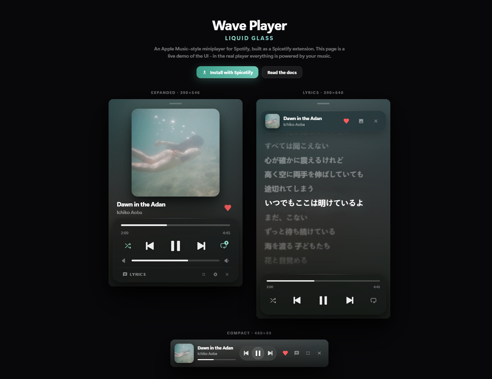

# Wave Player

Please ⭐ the project so more people find Wave Player!

Check out the **[live demo](https://03x1.github.io/Wave-Player/)**

# An Apple Music–style Miniplayer for Spotify

A small, beautiful player that floats **on top of everything** — powered by Liquid Glass.

## Three Modes

**Compact** for the corner of your screen. **Expanded** for the full player. **Lyrics** for singing along. Switch anytime with one click.

## Liquid Glass

Frosted glass cards, soft shadows, and colors pulled **live from the album art** — the player always matches your music.

## Synced Lyrics

Lyrics scroll with the song. The current line stays sharp while the rest gently blur and fade away.

## Replaces the Spotify Miniplayer

Click Spotify's miniplayer button and Wave Player opens instead. Close it from any mode with the ✕ button.

## Install

Get it from the **Spicetify Marketplace** — search "Wave Player".

Or manually: drop `waveplayer.js` into `%APPDATA%\spicetify\Extensions`, then run `spicetify config extensions waveplayer.js` and `spicetify apply`.

## Credits

Big shout out to the projects that inspired Wave Player:

- [Beautiful Lyrics](https://github.com/surfbryce/beautiful-lyrics/) by surfbryce
- [Spictify Lyric Miniplayer](https://github.com/FO-SS/Spictify-Lyric-Miniplayer) by FO-SS

## Have an Issue/Idea? Open one here on GitHub!
