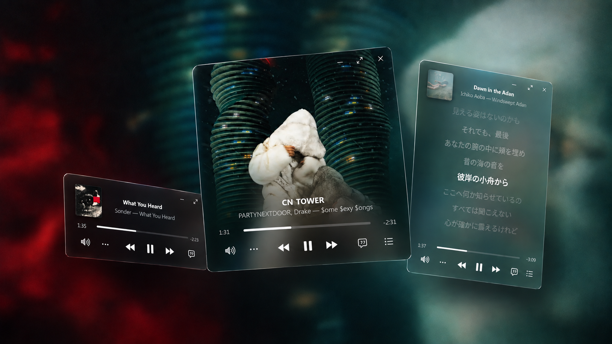

# Wave Player

Please ⭐ the project so more people find Wave Player!

Check out the **[live demo](https://03x1.github.io/Wave-Player/)**

# An Apple Music–style Miniplayer for Spotify

A small, beautiful player that floats **on top of everything**, modelled on Apple Music's mini player.

## Two Sizes

**Compact** for the corner of your screen: artwork, title, progress and controls in one strip. **Expanded** lets the artwork fill the window, with the controls laid over it. The expand button switches between them. The player reopens where you left it, and each view remembers the size you give it.

Songs with an animated cover (Spotify's Canvas) play it in the expanded view, just like on your phone. You can switch that off in Settings.

## Full Screen

Spotify's full screen button opens Wave Player full screen instead: a big cover with the controls under it, and the lyrics beside it. Shuffle, repeat and a volume slider sit under the controls, and Lyrics and Settings in the corner. Switch on **Lyrics only** in Settings to hide the cover and controls and just show the lyrics. Close it with ✕ or Esc.

## Colours From the Artwork

The background is made from the cover itself: its colours, blurred and swirling slowly behind the player, so every song gets its own look. In the expanded view the artwork fills the window instead.

## Synced Lyrics

The lyrics button opens them right in the player. They scroll with the song; the current line stays sharp while the rest gently blur and fade away.

Where the source has word timings, each word lights up as it's sung. Four sources are tried in order (Spotify, LRCLIB, NetEase and Musixmatch), and you can reorder or switch off any of them in Settings.

If a song's lyrics run early or late, nudge them with the − and + that appear at the bottom (or press `[` and `]`). The fix is remembered for that song.

## Up Next

The list button shows what's queued and what plays next. Click any song to jump to it. Shuffle and repeat live at the top.

## The ⋯ Menu

Save to Liked Songs, add to a playlist, go to the album or artist, copy the song link, a **sleep timer**, and **Settings**: background speed, animated covers, lyric sources and size, and auto-hiding controls (separately for compact, expanded and lyrics), and resetting window sizes.

Scroll anywhere on the player to change the volume. The volume slider closes by itself once you let go.

## Light on Your PC

The player only updates when something changes. The swirling background is drawn on the GPU at up to 60 frames a second and stops whenever it's covered or the window is hidden.

## Replaces the Spotify Miniplayer

Click Spotify's miniplayer button and Wave Player opens instead (its full screen button opens Wave Player full screen). Close it with the ✕ (or –) button. There's also a topbar button and `Ctrl+Shift+M` if you'd rather not use Spotify's.

## Install

Get it from the **Spicetify Marketplace** — search "Wave Player".

Needs a recent Spotify desktop app (one with Spotify's own miniplayer button).

Or manually: drop `waveplayer.js` into `%APPDATA%\spicetify\Extensions`, then run `spicetify config extensions waveplayer.js` and `spicetify apply`.

Note that `spicetify config extensions` appends, so running it twice registers the extension twice.

## Credits

Big shout out to the projects that inspired Wave Player:

- [Beautiful Lyrics](https://github.com/surfbryce/beautiful-lyrics/) by surfbryce
- [Spictify Lyric Miniplayer](https://github.com/FO-SS/Spictify-Lyric-Miniplayer) by FO-SS
- [Spicy Lyrics](https://github.com/Spikerko/spicy-lyrics) by Spikerko

Lyrics come from [LRCLIB](https://lrclib.net), NetEase and Musixmatch alongside Spotify's own.

## Have an Issue/Idea? Open one here on GitHub!

